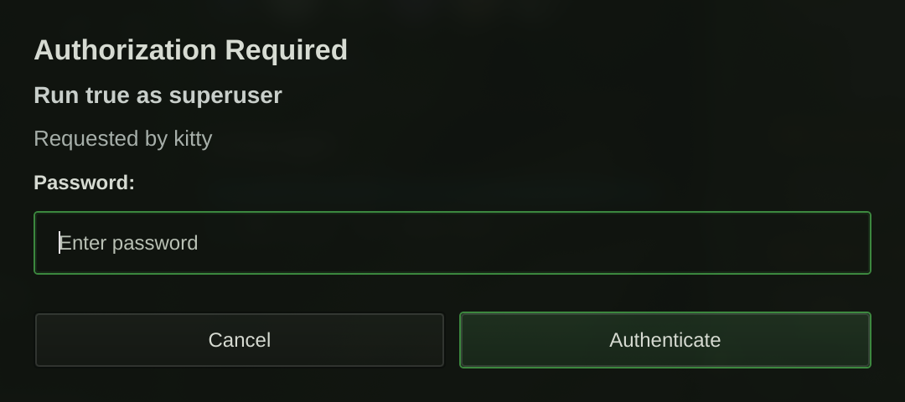

# bb-auth

Unified Linux authentication daemon for:

- polkit (`pkexec`)
- GNOME Keyring prompts
- GPG pinentry

> **Fork notice:** This repository is a personal fork of [bb-auth](https://github.com/anthonyhab/bb-auth), originally created by Anthony Hab. The original project and its work are not mine. This fork is maintained independently and is not an official continuation or replacement for upstream.

This fork is maintained primarily as the authentication backend for the [BB Auth plugin](https://github.com/branrgx/noctalia-plugins/tree/main/bb-auth) in my [Noctalia plugin collection](https://github.com/branrgx/noctalia-plugins). This repository provides the daemon and provider IPC, while the Noctalia v5 plugin provides the user-facing authentication interface. Development here may therefore prioritize compatibility, fixes, and improvements needed by that integration. This describes the maintenance direction of this fork; the original bb-auth project was not created specifically for Noctalia.

```text
Polkit / pinentry / keyring
          │
          ▼
       bb-auth
          │
          │ Provider IPC
          ▼
 Noctalia BB Auth plugin
          │
          ▼
 Authentication panel
```

It prefers an external UI provider when available, and falls back to the built-in Qt prompt when not.



## Install

Arch (AUR):

```bash
yay -S bb-auth-git
```

Manual:

```bash
git clone https://github.com/branrgx/bb-auth
cd bb-auth
cmake -S . -B build -DCMAKE_BUILD_TYPE=Release
cmake --build build -j"$(nproc)"
cmake --install build
```

## Enable

```bash
systemctl --user daemon-reload
systemctl --user enable --now bb-auth.service
systemctl --user status bb-auth.service
```

Quick prompt check:

```bash
pkexec echo ok
```

## Provider Model

- Core daemon stays minimal.
- UI providers are runtime drop-ins via manifests in `providers.d`.
- If provider is unavailable, built-in Qt fallback is launched automatically.

Provider contract:

- `docs/PROVIDER_CONTRACT.md`
- `docs/PROVIDER_PACKAGING.md`

## Common Problems

Service/log checks:

```bash
systemctl --user status bb-auth.service
journalctl --user -u bb-auth.service -n 200 --no-pager
```

GPG prompt still in terminal:

```bash
bb-auth-bootstrap
```

If another polkit agent is running, restart `bb-auth` after stopping the conflicting agent.

More:

- `docs/TROUBLESHOOTING.md`

## Development

Build and test:

```bash
cmake -S . -B build -DCMAKE_BUILD_TYPE=RelWithDebInfo
cmake --build build -j"$(nproc)"
ctest --test-dir build --output-on-failure
```

Pre-main local gates:

```bash
./scripts/gate-local.sh
```

Fast loop:

```bash
./scripts/gate-local.sh --quick
```

Replace local Arch install with your working tree build:

```bash
STRICT_DAEMON_SMOKE=1 ./scripts/gate-local.sh --deploy-local

# fastest packaging/install loop while iterating:
./scripts/gate-local.sh --deploy-only
```

Workflow:

- `docs/LOCAL_RELEASE_WORKFLOW.md`
- `AGENTS.md`

## License

MIT
